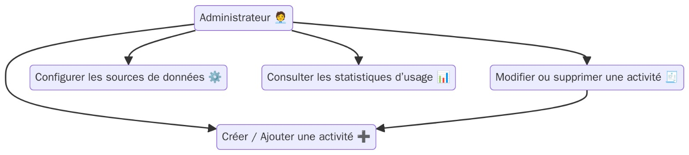
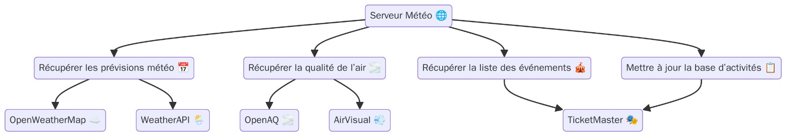
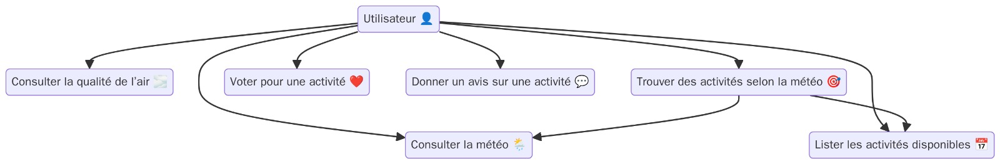
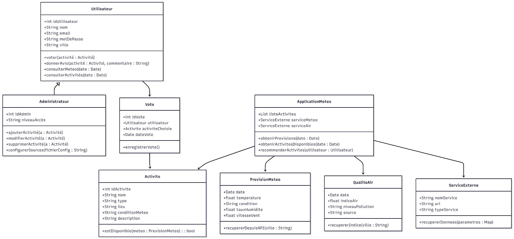
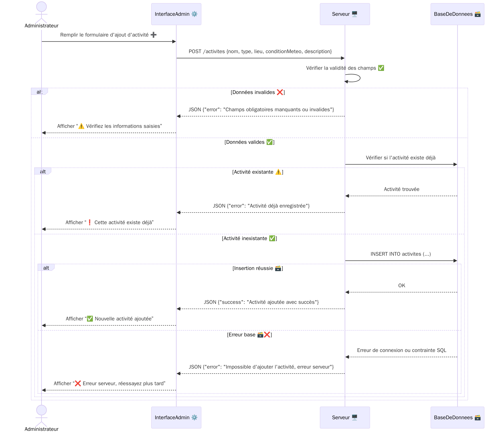
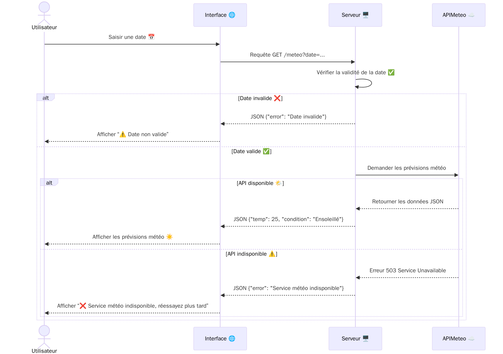
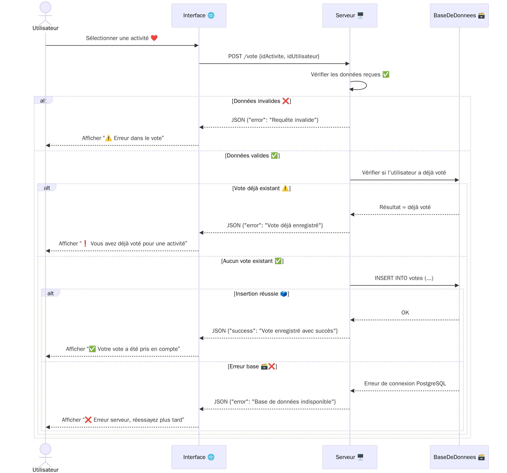
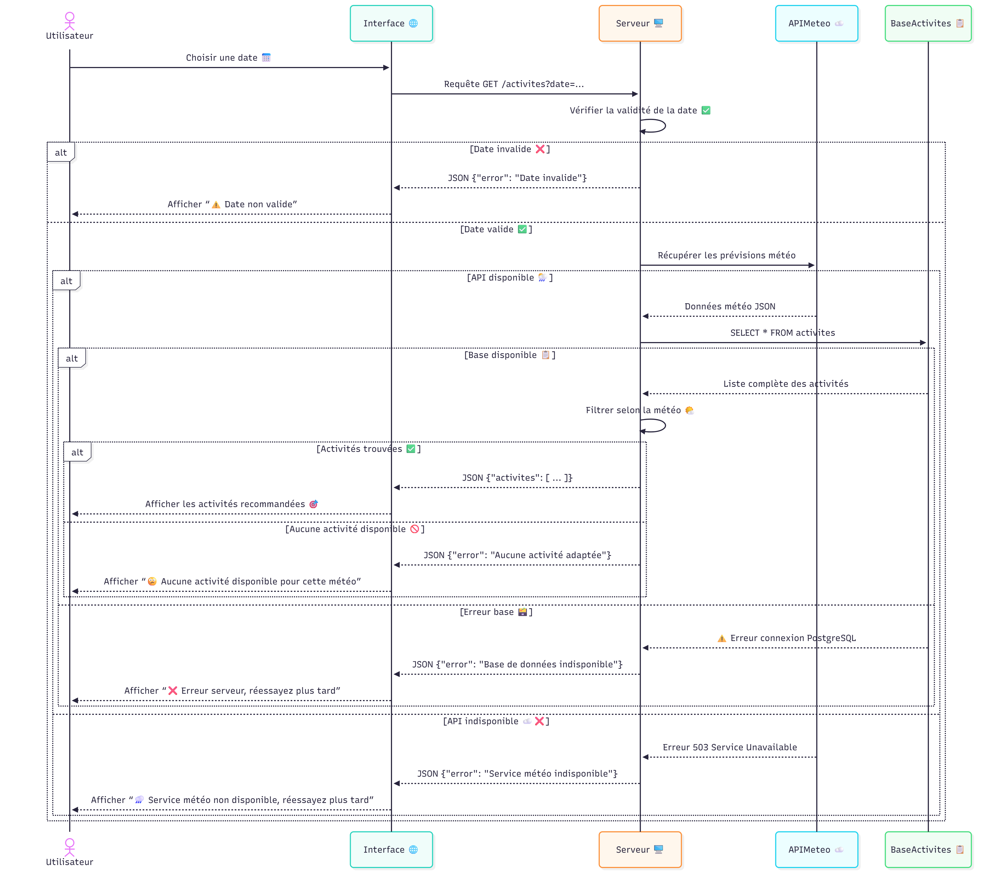

# Weather Project 🌦️

Un projet de gestion météo avec API RESTful utilisant **FastAPI**, **SQLAlchemy**, **Alembic** et **Docker**.  
Le projet inclut un système d'authentification JWT avec rôles, la gestion des activités météo et des schémas de base de données.

---

## Table des matières

- [Technologies](#technologies)
- [Diagrammes](#diagrammes)
- [Installation](#installation)
- [Configuration](#configuration)
- [Base de données](#base-de-données)
- [Lancement](#lancement)
- [Tests](#tests)
- [Structure du projet](#structure-du-projet)

---

## Technologies

- Python 3.9+
- FastAPI
- SQLAlchemy
- Alembic
- Docker & Docker Compose
- JWT pour l’authentification
- PostgreSQL (via Docker)

---

## Diagrammes

Les diagrammes sont disponibles dans le dossier `diagrams/` :

| Type | Fichier | Aperçu |
|------|---------|--------|
| Cas d'utilisation Admin | `cas_utilisation_admin.jpeg` |  |
| Cas d'utilisation Serveur météo | `cas_utilisation_serveur_meteo.jpeg` |  |
| Cas d'utilisation User | `cas_utilisation_user.jpeg` |  |
| Diagramme de classes | `diagram_class.jpeg` |  |
| Séquence Ajouter activité Admin | `sequence_ajouter_activite_admin.png` |  |
| Séquence Consultation météo UC1 | `sequence_consultation_meteo_uc1.png` |  |
| Séquence Vote activité | `sequence_vote_activite.png` |  |
| Séquence Trouver activités selon météo | `sequence_trouver_activites_meteo.png` |  |


---

## Installation

1. Cloner le projet :

```bash
git clone https://github.com/afif-yassine/weather_app.git
cd weather_app
```

2. Créer un environnement virtuel :

```bash
python -m venv venv
source venv/bin/activate  # Linux/macOS
venv\Scripts\activate     # Windows
```
3. Installer les dépendances :

```bash
pip install -r requirements.txt
```

---

## Configuration

Créer un fichier .env à la racine (ou dans server/src/core/config.py) avec les variables suivantes :
```bash
# Database
DB_USER=postgres
DB_PASSWORD=postgres
DB_HOST=db
DB_PORT=5432
DB_NAME=weather_db

# JWT
SECRET_KEY_ACCESS=
SECRET_KEY_REFRESH=
ALGORITHM=
ACCESS_TOKEN_EXPIRE=
REFRESH_TOKEN_EXPIRE=
```

---

## Base de données

Le projet utilise PostgreSQL via Docker Compose.

### Lancer la DB :

```bash
docker-compose up -d
```

### Exécuter les migrations Alembic :

```bash
alembic revision --autogenerate -m " Name of migration"

alembic upgrade head
```

### Vérifier la DB :

```bash
docker-compose logs 'name'
```

---

## Lancement de l’application
Depuis le dossier / :

```bash
uvicorn server.src.main:app --reload
```

Si vous utilisez Docker pour tout (DB + API) :
```bash
docker-compose up --build
```

---

## Tests
Pour lancer les tests :

```bash
pytest server/test
```

---

## Structure du projet
```bash
server/
├── src/
│   ├── api/                # Routes FastAPI
│   ├── core/               # Config, sécurité, init roles
│   ├── db/                 # Base et sessions SQLAlchemy
│   ├── middlewares/        # JWT middleware
│   ├── models/             # Modèles SQLAlchemy
│   ├── schemas/            # Schemas Pydantic
│   └── services/           # Services métier
├── test/                   # Tests unitaires
├── Dockerfile
└── requirements.txt
diagrams/                   # Diagrammes UML et séquences
alembic/                    # Migrations Alembic
alembic.ini
docker-compose.yml
```

---

## Notes

Tous les endpoints protégés utilisent JWT et peuvent être restreints selon le rôle via require_role([1,2]).

Les diagrammes aident à comprendre le flux et la structure des activités.

Ajouter vos propres activités et utilisateurs via l’API ou en remplissant la base de données.
